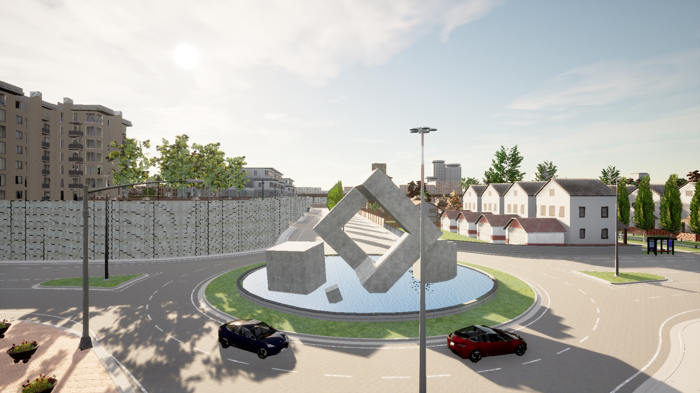
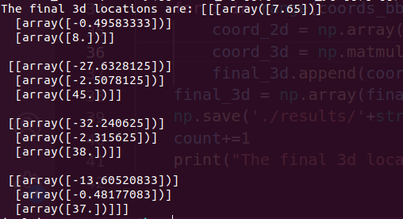

## Image Stiching and Multi Camera Data Collection from Carla:

Data is initially colloected from dual cameras in instantiated in Carla capturing the same scene at different yaw and roll angles to get overlapping scenes. The following images are the left and the right camera capture regions respectively:

<!--  -->

<!--  -->

### Image Stitching:
#### Method-1:
The freatures are extracted using the ORB feature extracter. Following this, the key point descriptors are passed through a matching algorithm like BFMatcher or FLANN matcher to get the matches which are then used to find the Homography and stich the images. After experimenting, the BFmatcher was finalized as it was quicker.

### Stitching result for the above images:

### Depth Map and 3D location prediction:
This stitched image is then passed through the depth network to get the depthand through the yolo model to get the objects. This is information is then used to predict the locations.

#### Result of the Depth Network for our Data:

#### Result of the YOLO Network for our Data:

#### 3D Location Prediction:

Once the depth data and the bounding box info has been obtained, the pixel coordinates of the central point of each bounding box of interest are computed and using the depth data and the intrinsic parameters of the camera, thee corresponding 3d location is computed. 
 

---

#### References

> [**YOLOv3: An Incremental Improvement**](https://arxiv.org/abs/1804.02767)

> [**Monocular Depth Estimation Using Laplacian Pyramid-Based Depth Residuals**](https://ieeexplore.ieee.org/document/9316778)

> [**Lapdepth Official Repository**](https://github.com/tjqansthd/LapDepth-release)

---
