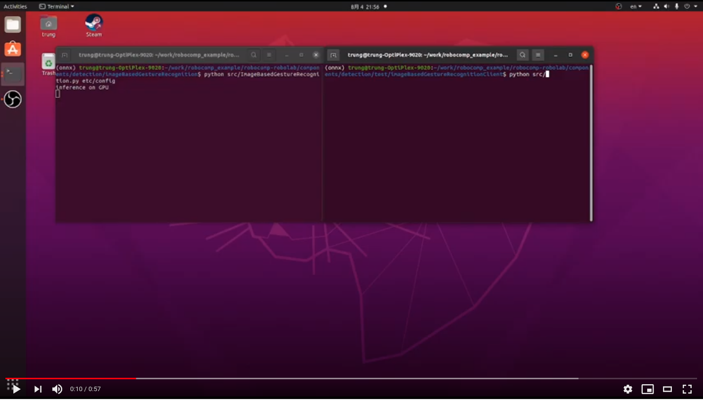

# GSoC'21 RoboComp project: Sign language recognition

14th Aug 2021

## Installation:
This component requires the same environment as HandPose and ImageBasedRecognition component, 
please check this [link](/web/gsoc/2021/posts/trung_ngo_tan/post03).

## Usage:
### Pose based Sign language recognition:
The pose detector component is in robocomp-robolab/components/detection/BodyHandJointsDetector/ . 
The recognized component is in robocomp-robolab/components/detection/poseBasedGestureRecognition .
and its client is in robocomp-robolab/components/detection/test/poseBasedGestureRecognitionClient/

Copy pretrained model from this [link](https://drive.google.com/file/d/1noNAokd8a39a1_DbOjLn5Hdi9LsI4snr/view?usp=sharing)
to src/_model/ in the detector component folder.

Steps:
1) Follow the introduction in the README.md to cmake the folder, and run the component. 
2) Run the detector and recognizer before the client.

This client will get image from camera and send to detector and get back the body pose + hand joints. 
Then these poses are collected and send to recognizer to get the class of gesture.

Currently, this component is still debugging.

## WLASL dataset:

As mentioned, we use WLASL dataset to recognize sign language. For demonstration, we just use the 100 classes WLASL models. 
Therefore, if users want to apply for larger range of classes in WLASL (1000 or 2000). Please follow these links:
+ [I3D weights pre-trained](https://drive.google.com/file/d/1jALimVOB69ifYkeT0Pe297S1z4U3jC48/view).
+ [Pose-TGCN](https://drive.google.com/file/d/1dzvocsaylRsjqaY4r_lyRihPZn0I6AA_/view).

Please clone this [git](https://github.com/dxli94/WLASL) for testing and converting pretrained pytorch model. The convert code can be found here:
+ [PoseTGN code to export onnx model](https://gist.github.com/rongtuech/2c0b7d500403f5a82560ad547f130941)
+ [I3D code to export onnx model](https://gist.github.com/rongtuech/a88a5448e4234d404ba5ef498f02f8f8)
Copy these code to relative folders (I3D and PoseTGN) in cloned repo from WLASL.
  
## Demo: 

HandBodyPoseDetector component/client:

ImageBasedRecognition component/client:

